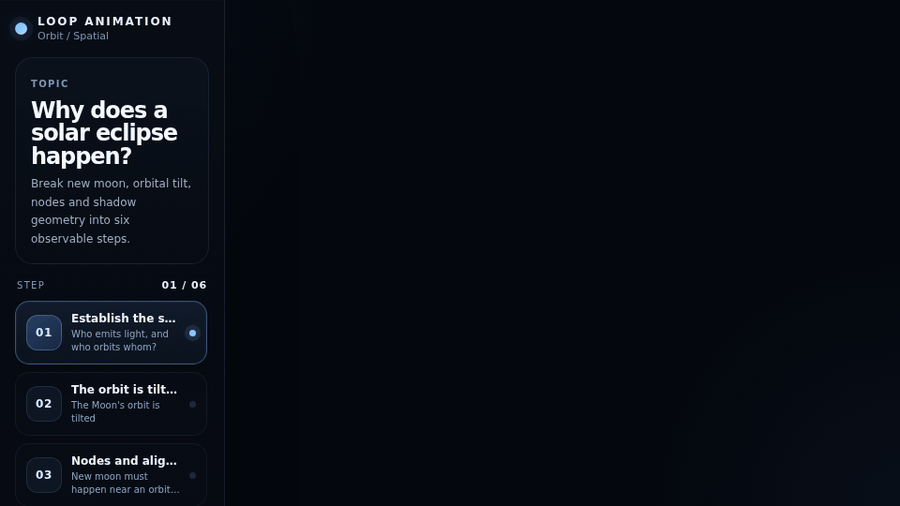

# Loop Animation

<p align="center">
  <strong>Turn concepts into interactive explainers with Codex + Three.js.</strong><br/>
  把知识点变成可交互的 Three.js 科普动画，并从同一份源码导出 HTML、MP4、GIF 和 PNG。
</p>

<p align="center">
  <a href="https://kevin-luo.github.io/loop-animation/"><strong>Live Gallery</strong></a> ·
  <a href="#english">English</a> ·
  <a href="#中文">中文</a>
</p>

<p align="center">
  
  
  
  
  
</p>

> **Don't animate text. Animate ideas.**  
> **别让文字动起来，让知识本身动起来。**

<p align="center">
  <a href="https://kevin-luo.github.io/loop-animation/?demo=eclipse">
    
  </a>
</p>

<p align="center">
  <sub>This GIF is generated automatically from the real Three.js scene by Puppeteer + FFmpeg. No hand-made mockup.</sub><br/>
  <sub>上面的 GIF 由仓库里的真实 Three.js 场景通过 Puppeteer + FFmpeg 自动渲染生成。</sub>
</p>

Loop Animation is an open-source **Codex Skill + deterministic Three.js animation runtime** for educational explainers. The interactive HTML is the source artifact. MP4, GIF, PNG and visual-QA frames are deterministic render targets of the same timeline.

```text
Concept / 知识点
      ↓
Learning goal / 教学目标
      ↓
Visual grammar / 视觉语法
      ↓
Storyboard / 分镜
      ↓
Three.js scene
      ↓
renderAt(time)
      ↓
Interactive HTML
   ┌──────┼────────┬──────────┐
   ↓      ↓        ↓          ↓
  MP4    GIF      PNG     Visual QA
```

## Live examples / 在线实例

| Example | Visual grammar | Live demo |
|---|---|---|
| Solar eclipse / 日食 | Orbit · Spatial | [Open](https://kevin-luo.github.io/loop-animation/?demo=eclipse) |
| DNS resolution / DNS 解析 | Flow · Network | [Open](https://kevin-luo.github.io/loop-animation/?demo=dns) |
| Binary search / 二分查找 | Algorithm · Process | [Open](https://kevin-luo.github.io/loop-animation/?demo=binary) |

The gallery itself is live at: **https://kevin-luo.github.io/loop-animation/**

---

# English

## What is Loop Animation?

Most AI-generated educational videos eventually become animated slides: a title, floating cards, paragraphs, decorative particles and generic transitions.

Loop Animation gives Codex a more opinionated production workflow:

1. verify the concept;
2. define one learning goal;
3. choose a visual grammar;
4. storyboard before coding;
5. build the explanation as a spatial Three.js scene;
6. drive every visible state from absolute time;
7. inspect representative frames;
8. export multiple formats from the same source.

The goal is not simply to create motion. The motion should make the mechanism easier to understand.

## What is included in v0.3?

- **Codex-native repo Skill** at `.agents/skills/loop-animation/`
- **Live GitHub Pages Gallery** with running Three.js demos
- **Three complete example explainers**
  - solar eclipse — spatial/orbit explanation
  - DNS resolution — network-flow explanation
  - binary search — algorithm/process explanation
- **Interactive HTML** — play, pause, seek and responsive layouts
- **Deterministic rendering** — every frame is derived from `renderAt(time)`
- **Multi-format export** — HTML, MP4, GIF and PNG
- **Multi-demo exporter** — choose `eclipse`, `dns` or `binary`
- **Visual QA** — generate scene-aware contact sheets before shipping
- **Vertical and landscape rendering**
- **CI-safe Puppeteer rendering**
- **Automatically generated README preview GIF**
- **GitHub Pages auto deployment**

## Requirements

Install:

- Node.js 22+
- npm
- FFmpeg for MP4/GIF export
- an environment where Puppeteer/Chromium can run

Check your environment:

```bash
node -v
npm -v
ffmpeg -version
```

## Quick start

```bash
git clone https://github.com/kevin-luo/loop-animation.git
cd loop-animation
npm install
npm run dev
```

Open the Vite URL printed in the terminal.

The root page is the example gallery. You can also open a specific demo by query parameter:

```text
?demo=eclipse
?demo=dns
?demo=binary
```

Useful commands:

```bash
npm run dev                 # development gallery + demos
npm run typecheck           # TypeScript check
npm run build               # static production build → dist/
npm run qa                  # QA the default eclipse demo
npm run qa:landscape        # landscape QA for the default demo
npm run export:mp4          # default eclipse → .output/eclipse.mp4
npm run export:gif          # default eclipse → .output/eclipse.gif
npm run export:png          # default eclipse → .output/eclipse-poster.png
npm run skill:install       # install Skill into ~/.agents/skills/
```

## Use it with Codex

### Method A — repo-scoped Skill (recommended)

Clone the repository and work inside it:

```bash
git clone https://github.com/kevin-luo/loop-animation.git
cd loop-animation
npm install
```

The repository contains:

```text
.agents/skills/loop-animation/SKILL.md
```

Invoke the Skill explicitly:

```text
$loop-animation
```

Example:

```text
$loop-animation

Explain why seasons happen.

Audience: general audience
Duration: 45 seconds
Format: 9:16
Language: English
Outputs: interactive HTML + MP4 + GIF

Requirements:
- show Earth's axial tilt spatially
- keep the Sun and Earth visible across scenes
- avoid slide-like cards
- let the viewer scrub the timeline
- run visual QA before final export
```

Technical example:

```text
$loop-animation

Create an interactive explainer for how an HTTP request travels through:
browser → DNS → CDN → origin server → browser.

Audience: junior developers
Duration: 35 seconds
Format: 16:9
Outputs: HTML + 1080p MP4

Requirements:
- use moving packets as the primary visual language
- preserve node positions across scenes
- keep labels short
- show request and response as different states
- run visual QA before export
```

### Method B — install the Skill globally for your user

From the cloned repository:

```bash
npm run skill:install
```

It copies the Skill to:

```text
$HOME/.agents/skills/loop-animation
```

Overwrite an existing installation:

```bash
npm run skill:install:force
```

Restart Codex if the Skill list does not refresh immediately.

## Recommended prompt structure

You usually only need:

```text
$loop-animation

Topic: <what should be explained>
Audience: <who will watch>
Duration: <seconds>
Format: <16:9 / 9:16 / 3:4 / square>
Outputs: <HTML / MP4 / GIF / PNG>

Requirements:
- <the mechanism that must be visually explained>
- <important objects that should persist>
- <interaction requirement if useful>
- run visual QA before export
```

The Skill should decide the visual grammar before it starts writing animation code.

## Live Gallery

The root production build is a showcase page. It embeds the real running examples instead of screenshots.

```bash
npm run dev
```

Then open the home page and choose:

- **Eclipse** — spatial alignment and orbit geometry
- **DNS** — packet movement across a network hierarchy
- **Binary Search** — shrinking search space over time

Direct URLs use query parameters, so one static build can host multiple explainers:

```text
/?demo=eclipse
/?demo=dns
/?demo=binary
```

For lightweight Gallery cards, the site uses:

```text
?demo=eclipse&embed=1
```

`embed=1` hides playback chrome and automatically starts the same deterministic animation.

## Export HTML

```bash
npm run build
```

Output:

```text
dist/
```

The static build contains the Gallery and all demo routes.

## Export MP4

Default example:

```bash
npm run export:mp4
```

Output:

```text
.output/eclipse.mp4
```

Export the DNS demo as landscape 1080p:

```bash
npm run build
node scripts/export.mjs \
  --format mp4 \
  --demo dns \
  --width 1920 \
  --height 1080 \
  --fps 30
```

Output:

```text
.output/dns.mp4
```

Vertical binary-search video:

```bash
npm run build
node scripts/export.mjs \
  --format mp4 \
  --demo binary \
  --width 1080 \
  --height 1920 \
  --fps 30
```

## Export GIF

Default:

```bash
npm run export:gif
```

Output:

```text
.output/eclipse.gif
```

Choose another demo:

```bash
npm run build
node scripts/export.mjs --format gif --demo dns --width 900 --height 506 --fps 15
```

GIF is useful for GitHub README previews and quick social sharing. Use MP4 for final video quality.

## Export PNG

```bash
npm run export:png
```

Output:

```text
.output/eclipse-poster.png
```

Choose demo and timestamp:

```bash
npm run build
node scripts/export.mjs \
  --format png \
  --demo binary \
  --time 10.8 \
  --width 1920 \
  --height 1080
```

## Visual QA

Code can compile while the animation is visually broken. Visual QA is therefore part of the workflow.

Default eclipse QA:

```bash
npm run qa
```

Output:

```text
.output/qa/eclipse/
├── contact-sheet.png
├── report.json
└── frames/
```

QA another demo:

```bash
npm run build
node scripts/qa.mjs --demo dns
```

Landscape QA:

```bash
npm run build
node scripts/qa.mjs \
  --demo binary \
  --width 1920 \
  --height 1080
```

Each example defines scene-aware `qaTimes`, so the contact sheet includes important boundaries and state changes instead of only evenly spaced timestamps.

Inspect the sheet for:

- clipped labels;
- overlapping objects;
- unreadable text;
- weak focal hierarchy;
- dead or nearly identical scenes;
- abrupt transitions;
- poor 9:16 composition;
- misleading geometry;
- visual states that only make sense when narration is present.

## Deterministic timeline

Every explainer exposes:

```ts
interface LoopAnimationController {
  duration: number;
  ready: boolean;
  qaTimes?: readonly number[];
  renderAt(time: number): void;
  play(): void;
  pause(): void;
  seek(time: number): void;
  destroy(): void;
}
```

The controller is attached to:

```ts
window.__LOOP_ANIMATION__
```

The important invariant is:

```ts
renderAt(8.0)
```

should produce the same conceptual frame whether it is reached by:

- normal playback;
- dragging the scrubber;
- jumping backward;
- 30 FPS export;
- 60 FPS export;
- screenshot QA.

Avoid export-critical state driven by accumulated `deltaTime`, unseeded randomness or wall-clock time.

## Create a new explainer manually

Codex is the intended authoring experience, but the runtime is small enough to use directly.

Create:

```text
examples/my-topic/storyboard.md
src/examples/my-topic/main.ts
src/examples/my-topic/style.css
```

Reuse the runtime:

```ts
import { DeterministicTimeline } from '../../runtime/animation';

const controller = new DeterministicTimeline({
  duration: 20,
  qaTimes: [0, 4, 8, 12, 16, 19.9],
  onRender(time) {
    // Derive every visible state from absolute `time`.
    renderer.render(scene, camera);
  },
});

window.__LOOP_ANIMATION__ = controller;
```

Register the demo in `src/main.ts` if you want it to appear as a route, and add a card in `src/gallery/main.ts` if you want it in the public showcase.

Then run:

```bash
npm run typecheck
npm run build
node scripts/qa.mjs --demo my-topic
```

If you introduce a new demo ID, extend the accepted demo list in `scripts/qa.mjs` and `scripts/export.mjs` or refactor it into a shared registry.

## Visual grammars

| Grammar | Best for | Examples |
|---|---|---|
| Scale | relative size / distance | atom → cell → human → Earth |
| Inside | layers / internals | CPU, engine, body, architecture |
| Flow | moving information or matter | DNS, HTTP, blood, electricity |
| Compare | mechanism comparison | SSD vs HDD, lungs vs gills |
| Cause-effect | causal chains | greenhouse effect, feedback loops |
| Timeline | change over time | universe, evolution, history |
| Orbit / spatial | geometry in space | eclipse, seasons, tides |
| Algorithm / process | state reduction / execution | binary search, sorting, scheduling |
| Simulation | parameter exploration | waves, probability, orbital tilt |

## Project structure

```text
loop-animation/
├── .agents/
│   └── skills/loop-animation/
│       ├── SKILL.md
│       └── agents/openai.yaml
├── .github/workflows/
│   ├── ci.yml
│   ├── pages.yml
│   └── preview-media.yml
├── docs/media/
│   └── eclipse.gif
├── examples/
│   ├── eclipse/storyboard.md
│   ├── dns/storyboard.md
│   └── binary/storyboard.md
├── scripts/
│   ├── export.mjs
│   ├── qa.mjs
│   └── install-skill.mjs
├── src/
│   ├── main.ts
│   ├── gallery/
│   ├── runtime/
│   │   └── animation.ts
│   └── examples/
│       ├── eclipse/
│       ├── dns/
│       └── binary/
├── references/
├── index.html
├── vite.config.ts
└── package.json
```

## Generated preview media

The README GIF is not a hand-made marketing asset. GitHub Actions runs:

```text
Three.js demo
    ↓
Puppeteer deterministic frames
    ↓
FFmpeg palette + GIF encoding
    ↓
docs/media/eclipse.gif
```

The workflow lives at:

```text
.github/workflows/preview-media.yml
```

This gives the repository a preview that stays tied to the real implementation.

## Design rules

**Prefer**

- one visual idea per scene;
- object continuity;
- spatial explanation;
- concise labels anchored to objects;
- meaningful transformations;
- restrained camera movement;
- responsive composition;
- motion that encodes causality, direction, scale or state.

**Avoid**

- generic glowing cards;
- decorative neon gradients;
- random particles without teaching value;
- constant zooming;
- large text blocks;
- unexplained object pop-in/pop-out;
- tiny 3D text;
- frame-rate-dependent exports;
- using animation only as decoration.

## Troubleshooting

### FFmpeg is missing

```bash
ffmpeg -version
```

If it is not found, install FFmpeg and reopen the terminal.

### Puppeteer / Chromium does not launch

Run:

```bash
npm install
```

The export and QA scripts include CI-safe Chromium flags for Linux environments that do not provide a usable browser sandbox.

### Codex does not see `$loop-animation`

Repo scope:

```text
.agents/skills/loop-animation/SKILL.md
```

User scope:

```bash
npm run skill:install:force
```

Then restart Codex if necessary.

### Video differs from HTML

Look for:

- unseeded `Math.random()`;
- cumulative mutations between frames;
- `deltaTime`-driven export-critical animation;
- assets that are not ready before the controller reports `ready`;
- hard-coded composition for only one aspect ratio.

## Roadmap

- [x] Codex repository Skill
- [x] deterministic Three.js timeline
- [x] interactive HTML playback
- [x] MP4 / GIF / PNG export
- [x] visual-QA contact sheets
- [x] user-level Skill installer
- [x] GitHub Pages deployment
- [x] live multi-example Gallery
- [x] solar-eclipse spatial example
- [x] DNS network-flow example
- [x] binary-search process example
- [x] generated README GIF from the real renderer
- [ ] reusable Scale starter template
- [ ] reusable Timeline starter template
- [ ] reusable Inside / architecture starter template
- [ ] subtitle tracks
- [ ] optional audio / TTS composition
- [ ] automated visual regression comparison
- [ ] example registry to remove hard-coded demo IDs

---

# 中文

## Loop Animation 是什么？

Loop Animation 是一个面向 **Codex + Three.js** 的开源科普动画 Skill，同时提供一套确定性动画运行时和导出工具链。

你可以给 Codex 一个知识点：

```text
为什么会发生日食？
DNS 是怎么找到网站的？
为什么二分查找这么快？
CPU 缓存为什么能加速？
原子到底有多小？
四季为什么会变化？
```

Skill 会要求 Codex 先理解“到底要解释什么”，再选择合适的视觉语言：

```text
知识点核查
   ↓
确定一个教学目标
   ↓
选择视觉语法
   ↓
先写分镜
   ↓
Three.js 场景
   ↓
renderAt(time)
   ↓
可交互 HTML
   ↓
视觉 QA
   ↓
HTML / MP4 / GIF / PNG
```

核心理念：

> **HTML 是源作品，视频、GIF、封面图只是同一条确定性时间轴的不同渲染结果。**

这意味着生成出来的内容可以暂停、拖进度、改变画幅、继续增加交互，同时又能稳定导出为视频。

## V0.3 现在有什么？

目前已经完成：

- Codex 可自动发现的 Repo Skill
- GitHub Pages 在线 Gallery
- 3 个真实 Three.js 示例动画
- 播放 / 暂停 / 时间轴拖动
- `renderAt(time)` 确定性逐帧渲染
- HTML 静态构建
- 多 Demo MP4 导出
- 多 Demo GIF 导出
- 多 Demo PNG 导出
- 竖屏 / 横屏视觉 QA
- 场景边界 QA 抽帧
- Contact Sheet 总览图
- GitHub Pages 自动部署
- 用户级 Skill 一键安装
- GitHub Actions 自动生成 README GIF

## 在线看效果

直接打开项目的 **Live Gallery**：

**https://kevin-luo.github.io/loop-animation/**

当前包含：

### 1. 日食 / Eclipse

视觉语法：`Orbit / Spatial`

解释太阳、月球、地球的位置关系，以及月球影子为什么会落到地球上。

在线：

```text
https://kevin-luo.github.io/loop-animation/?demo=eclipse
```

### 2. DNS 域名解析

视觉语法：`Flow / Network`

让查询包真正沿着：

```text
Browser
  ↓
Resolver
  ↓
Root DNS
  ↓
.com TLD
  ↓
Authoritative DNS
  ↓
IP 返回
```

在线：

```text
https://kevin-luo.github.io/loop-animation/?demo=dns
```

### 3. 二分查找 / Binary Search

视觉语法：`Algorithm / Process`

通过每次暗掉一半候选区间，让人直接看到“为什么二分查找快”。

在线：

```text
https://kevin-luo.github.io/loop-animation/?demo=binary
```

## 环境要求

需要：

- Node.js 22+
- npm
- FFmpeg（MP4 / GIF 导出需要）
- 可以运行 Puppeteer / Chromium 的环境

检查：

```bash
node -v
npm -v
ffmpeg -version
```

## 第一次运行

```bash
git clone https://github.com/kevin-luo/loop-animation.git
cd loop-animation
npm install
npm run dev
```

打开终端给出的 Vite 地址。

现在首页会看到 Gallery，而不是只展示一个 Demo。

常用命令：

```bash
npm run dev
npm run typecheck
npm run build
npm run qa
npm run qa:landscape
npm run export:mp4
npm run export:gif
npm run export:png
```

## 在 Codex 里怎么用

### 方式一：直接使用仓库内 Skill

```bash
git clone https://github.com/kevin-luo/loop-animation.git
cd loop-animation
npm install
```

仓库中已经存在：

```text
.agents/skills/loop-animation/SKILL.md
```

在 Codex 中调用：

```text
$loop-animation
```

然后描述需求：

```text
$loop-animation

做一个“为什么会有四季”的科普动画。

受众：普通人
时长：45 秒
语言：中文
画幅：9:16
输出：HTML + MP4 + GIF

要求：
- 必须真正展示地轴倾角和公转关系
- 太阳和地球尽量保持视觉连续
- 少文字
- 不要做成 PPT 卡片动画
- 可以拖动时间轴
- 导出前先跑视觉 QA
```

程序员科普示例：

```text
$loop-animation

做一个“HTTP 请求到底经历了什么”的交互动画。

从用户在浏览器输入 URL 开始，展示：
DNS → CDN → Origin Server → Response。

要求：
- 16:9
- 35 秒
- 数据包要真的沿节点移动
- 请求和响应有明显的方向区别
- 每个节点只保留很短的标签
- 输出 HTML + 1080P MP4
- 导出前做视觉 QA
```

### 方式二：安装为用户级 Skill

```bash
npm run skill:install
```

会安装到：

```text
$HOME/.agents/skills/loop-animation
```

覆盖旧版本：

```bash
npm run skill:install:force
```

之后在其他项目里也可以尝试：

```text
$loop-animation
```

## 推荐的提示词结构

不用写超长提示词。

建议把下面几个信息说明白：

```text
$loop-animation

主题：<知识点>
受众：<普通人 / 学生 / 程序员等>
时长：<30 秒 / 60 秒等>
画幅：<16:9 / 9:16 / 3:4 / 1:1>
输出：<HTML / MP4 / GIF / PNG>

重点：
- 真正需要解释清楚的机制
- 哪些对象需要保持视觉连续
- 是否需要交互
- 导出前运行视觉 QA
```

## 导出 HTML

```bash
npm run build
```

输出：

```text
dist/
```

这个目录就是可静态部署的完整网站，包括 Gallery 和 Demo 路由。

## 导出 MP4

默认导出日食：

```bash
npm run export:mp4
```

输出：

```text
.output/eclipse.mp4
```

导出 DNS 横屏 1080P：

```bash
npm run build
node scripts/export.mjs \
  --format mp4 \
  --demo dns \
  --width 1920 \
  --height 1080 \
  --fps 30
```

导出二分查找竖屏：

```bash
npm run build
node scripts/export.mjs \
  --format mp4 \
  --demo binary \
  --width 1080 \
  --height 1920 \
  --fps 30
```

## 导出 GIF

```bash
npm run export:gif
```

默认输出：

```text
.output/eclipse.gif
```

指定 DNS：

```bash
npm run build
node scripts/export.mjs \
  --format gif \
  --demo dns \
  --width 900 \
  --height 506 \
  --fps 15
```

README 顶部展示的日食 GIF，就是这套真实导出链路自动生成的。

## 导出 PNG 封面

```bash
npm run export:png
```

默认：

```text
.output/eclipse-poster.png
```

指定 Demo、时间和画幅：

```bash
npm run build
node scripts/export.mjs \
  --format png \
  --demo binary \
  --time 10.8 \
  --width 1920 \
  --height 1080
```

## 视觉 QA 怎么用

动画能编译通过，不代表动画真的好看，也不代表不同画幅下没有遮挡。

默认检查日食：

```bash
npm run qa
```

输出：

```text
.output/qa/eclipse/
├── contact-sheet.png
├── report.json
└── frames/
```

检查 DNS：

```bash
npm run build
node scripts/qa.mjs --demo dns
```

横屏检查二分查找：

```bash
npm run build
node scripts/qa.mjs \
  --demo binary \
  --width 1920 \
  --height 1080
```

每个示例都有自己的 `qaTimes`，会重点抽取转场前后和状态变化位置。

重点看：

- 元素有没有遮挡
- 文字有没有被裁掉
- 重点是否明确
- 画面是否几秒不动
- 状态切换是否突兀
- 竖屏是否拥挤
- 标签是否太小
- 几何表达是否可能误导知识点
- 去掉旁白以后，动画本身还能不能大致讲清原理

## 为什么必须使用 `renderAt(time)`？

核心接口：

```ts
renderAt(time: number)
```

同一个时间点，比如：

```ts
renderAt(8.0)
```

无论用户是：

```text
正常播放到 8 秒
手动拖到 8 秒
从 12 秒倒拖到 8 秒
30FPS 导出第 240 帧
60FPS 导出第 480 帧
QA 截取 8 秒
```

都应该得到一致的概念状态。

所以尽量避免：

```text
未固定 seed 的随机数
依赖 deltaTime 累加状态
依赖系统真实时间
每一帧在上一帧基础上继续变更关键状态
```

## 手动增加一个新的实例

建议目录：

```text
examples/my-topic/storyboard.md
src/examples/my-topic/main.ts
src/examples/my-topic/style.css
```

使用公共运行时：

```ts
import { DeterministicTimeline } from '../../runtime/animation';

const controller = new DeterministicTimeline({
  duration: 20,
  qaTimes: [0, 4, 8, 12, 16, 19.9],
  onRender(time) {
    // 所有关键状态都从绝对时间 time 推导
    renderer.render(scene, camera);
  },
});

window.__LOOP_ANIMATION__ = controller;
```

如果想显示到 Gallery，需要：

1. 在 `src/main.ts` 注册 Demo；
2. 在 `src/gallery/main.ts` 增加卡片；
3. 给 `scripts/export.mjs` 和 `scripts/qa.mjs` 增加对应 Demo ID。

后续 Roadmap 会把这几处硬编码收敛成统一 Example Registry。

## 视觉语法

| 类型 | 适合解释 | 示例 |
|---|---|---|
| Scale | 尺度、距离、数量级 | 原子 → 细胞 → 人 → 地球 |
| Inside | 内部结构、分层 | CPU、发动机、人体、软件架构 |
| Flow | 信息、能量、物质流动 | DNS、HTTP、血液、电流 |
| Compare | 两种机制对比 | SSD vs HDD、肺 vs 鱼鳃 |
| Cause-effect | 因果链 | 温室效应、反馈回路 |
| Timeline | 时间演变 | 宇宙、进化、历史 |
| Orbit / Spatial | 空间几何 | 日食、四季、潮汐 |
| Algorithm / Process | 算法与状态变化 | 二分查找、排序、调度 |
| Simulation | 参数探索 | 波、概率、轨道倾角 |

## 目前的项目结构

```text
loop-animation/
├── .agents/skills/loop-animation/
├── .github/workflows/
│   ├── ci.yml
│   ├── pages.yml
│   └── preview-media.yml
├── docs/media/
│   └── eclipse.gif
├── examples/
│   ├── eclipse/
│   ├── dns/
│   └── binary/
├── scripts/
│   ├── export.mjs
│   ├── qa.mjs
│   └── install-skill.mjs
├── src/
│   ├── gallery/
│   ├── runtime/
│   └── examples/
│       ├── eclipse/
│       ├── dns/
│       └── binary/
└── README.md
```

## README 动图是怎么来的？

不是人工做了一张演示 GIF 放上去。

仓库的 GitHub Actions 会真实执行：

```text
Three.js Demo
    ↓
Puppeteer Headless Chrome
    ↓
按 renderAt(time) 逐帧截图
    ↓
FFmpeg
    ↓
docs/media/eclipse.gif
```

这样以后动画实现变化了，可以重新生成预览，README 展示效果和真实代码保持一致。

## 设计原则

建议：

- 一个场景只强调一个核心视觉点
- 尽量保持对象连续存在
- 用空间关系解释空间问题
- 标签短而明确
- 动画变化本身要带信息
- 摄像机运动克制
- 同时考虑 16:9 和 9:16
- 能用图形说明，就少放一段文字

尽量避免：

- 所有东西都套发光卡片
- 没意义的渐变、粒子、漂浮
- 镜头一直放大缩小
- 满屏文字
- 物体无原因突然消失/出现
- 把大段解释做成“会动的 PPT”
- 导出效果依赖 FPS

## 常见问题

### 找不到 FFmpeg

```bash
ffmpeg -version
```

没有的话安装 FFmpeg，再重新打开终端。

### Puppeteer / Chromium 启动失败

先执行：

```bash
npm install
```

当前 exporter 和 QA 脚本已经加入 Linux CI 环境所需的 Chromium sandbox 兼容参数。

### Codex 找不到 `$loop-animation`

仓库模式确认：

```text
.agents/skills/loop-animation/SKILL.md
```

全局安装：

```bash
npm run skill:install:force
```

如果仍然没有刷新，重启 Codex。

### HTML 看起来正常，导出视频不一样

重点排查：

- `Math.random()` 是否固定 seed
- 有没有依赖 `deltaTime`
- 是否存在累加状态
- 资源是否在 `ready` 前加载完成
- CSS / Camera 是否只适配单一画幅

## Roadmap

- [x] Codex Repo Skill
- [x] Three.js 确定性时间轴
- [x] HTML 交互播放
- [x] MP4 / GIF / PNG 导出
- [x] Visual QA Contact Sheet
- [x] 用户级 Skill 安装
- [x] GitHub Pages
- [x] Live Gallery
- [x] 日食实例
- [x] DNS 网络流实例
- [x] 二分查找算法实例
- [x] 真实渲染 README GIF
- [ ] Scale 尺度模板
- [ ] Timeline 时间线模板
- [ ] Inside / 架构模板
- [ ] 字幕轨道
- [ ] 可选 TTS / 音频合成
- [ ] 自动视觉回归比较
- [ ] Example Registry

## Contributing

Contributions are welcome, especially:

- new visual grammars and reusable patterns;
- polished educational examples;
- export improvements;
- QA tooling;
- accessibility improvements;
- responsive 9:16 / 16:9 composition patterns.

See [`CONTRIBUTING.md`](./CONTRIBUTING.md).

## License

MIT
