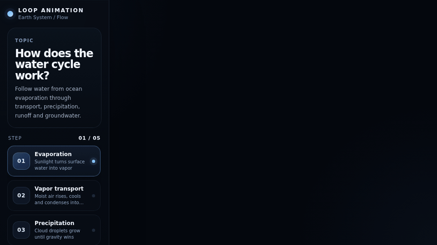

# Loop Animation

<p align="center">
  <strong>Turn concepts into continuous interactive visual stories with Codex + Three.js.</strong><br/>
  用 Codex + Three.js，把知识点变成连续、可解释、可交互、可导出的视觉故事。
</p>

<p align="center">
  <a href="https://kevin-luo.github.io/loop-animation/"><strong>Live Gallery</strong></a> ·
  <a href="#english">English</a> ·
  <a href="#中文">中文</a>
</p>

<p align="center">
  
  
  
  
  
  
</p>

> **The chapter changes. The world does not reset.**  
> **章节会切换，世界不会重置。**

<p align="center">
  <a href="https://kevin-luo.github.io/loop-animation/?demo=water">
    
  </a>
</p>

<p align="center">
  <sub>The preview is rendered automatically from the real deterministic Three.js scene by Puppeteer + FFmpeg.</sub><br/>
  <sub>上面的预览由真实的确定性 Three.js 场景通过 Puppeteer + FFmpeg 自动生成。</sub>
</p>

## Live examples / 在线实例

| Example | Status | Visual grammar | Live |
|---|---|---|---|
| Water cycle / 水循环 | **Flagship · continuity gated** | Earth system · Flow | [Open](https://kevin-luo.github.io/loop-animation/?demo=water) |
| Solar eclipse / 日食 | **Flagship · continuity gated** | Orbit · Spatial | [Open](https://kevin-luo.github.io/loop-animation/?demo=eclipse) |
| DNS resolution / DNS 解析 | Earlier experiment | Network · Flow | [Open](https://kevin-luo.github.io/loop-animation/?demo=dns) |
| Binary search / 二分查找 | Earlier experiment | Algorithm · Process | [Open](https://kevin-luo.github.io/loop-animation/?demo=binary) |

**Gallery:** https://kevin-luo.github.io/loop-animation/

```text
                       ONE SOURCE OF TRUTH

                ┌───────────────────────────┐
                │ Continuous world S(t)     │
                │ camera / objects / motion │
                └─────────────┬─────────────┘
                              │
                ┌─────────────▼─────────────┐
                │ Story Manifest            │
                │ chapters / narration      │
                │ timing / key ideas        │
                └─────────────┬─────────────┘
                              │
      ┌────────────┬──────────┼──────────┬───────────┐
      ▼            ▼          ▼          ▼           ▼
 Interactive     MP4/GIF     PNG       SRT/VTT    narration
    HTML          video     poster     captions       JSON
```

---

# English

## What is Loop Animation?

Loop Animation is an open-source **Codex Skill + deterministic Three.js runtime + story/export/QA toolchain** for educational explainers.

The project is built around one rule:

> An explainer should be one world evolving through time, not a stack of animated slides.

The architecture separates three things that AI-generated animations often mix together:

```text
WORLD STATE             STORY METADATA          VIEW / OUTPUT
S(t)                    chapters               HTML controls
camera(t)               narration              captions
objects(t)              key ideas              language switch
materials(t)            timestamps             MP4 / GIF / PNG
particles(t)                                    SRT / VTT / narration
```

Chapters tell the learner **where the explanation is**. They do not reset the camera or replace the visual world.

## Why continuity matters

A common generated-animation pattern looks like this:

```ts
if (step === 1) camera.position.set(...);
if (step === 2) camera.position.set(...);
object.visible = step === 3;
```

It works as a slideshow, but normal playback jumps at every chapter boundary.

Loop Animation instead treats all important visual state as a function of absolute time:

```ts
const rain = envelope(time, 8.6, 10.7, 16.8, 18.7);
rainMaterial.opacity = rain;

cameraCurve.getPointAt(time / DURATION, camera.position);
```

For a chapter boundary `b`, the target is approximately:

```text
S(b - ε) ≈ S(b + ε)
```

That rule is now automatically checked in CI.

## v0.5 highlights

- continuous world model `S(t)` instead of step-owned scenes;
- headless observable `DeterministicTimeline`;
- smooth `reveal()` / `envelope()` transition helpers;
- stage-first interactive film UI instead of permanent dashboard panels;
- directly scrubbable Storyline timeline;
- optional deeper explanation drawer;
- continuous camera curves in flagship demos;
- WebGL resizing via `ResizeObserver`, not every frame;
- interactive DPR capped for smoother playback;
- `THREE.Points` particle fields in the water-cycle flagship;
- automated chapter-boundary continuity QA;
- localized **Story Manifest** shared by UI, subtitles and future TTS;
- HTML / MP4 / GIF / PNG / SRT / VTT / narration JSON outputs;
- clean Chinese / English switching without mixed-language screens.

## Quick start

Requirements:

- Node.js 22+
- npm
- FFmpeg for MP4/GIF export
- a Puppeteer-compatible Chromium environment for export and QA

```bash
git clone https://github.com/kevin-luo/loop-animation.git
cd loop-animation
npm install
npm run dev
```

Demo routes:

```text
?demo=water
?demo=eclipse
?demo=dns
?demo=binary
```

## Use with Codex

The repository contains a repo-scoped Codex Skill:

```text
.agents/skills/loop-animation/SKILL.md
```

Inside the repository:

```text
$loop-animation
```

Recommended prompt:

```text
$loop-animation

Explain how the water cycle works.

Audience: general audience
Language: English
Duration: 35 seconds
Format: 16:9
Outputs: interactive HTML + MP4 + GIF + SRT

Requirements:
- design one continuous world S(t)
- use 5 chapters only as narration/navigation bookmarks
- never switch camera/object state with if (step === ...)
- keep one water drop visually continuous across the explanation
- let the visual stage dominate the screen
- chapter summaries must also work as subtitle/narration cues
- run strict boundary continuity QA before export
```

Technical example:

```text
$loop-animation

Explain a TCP three-way handshake.

Audience: junior developers
Language: Chinese
Duration: 30 seconds
Outputs: HTML + MP4 + SRT

Requirements:
- Client and Server remain persistent objects
- SYN → SYN-ACK → ACK are chapters, not separate scenes
- packets move continuously along stable routes
- narration changes without resetting the network world
- run continuity QA before export
```

## Install the Skill globally

```bash
npm run skill:install
```

Installed to:

```text
$HOME/.agents/skills/loop-animation
```

Overwrite an existing installation:

```bash
npm run skill:install:force
```

## Runtime architecture

### DeterministicTimeline

`src/runtime/animation.ts` owns time and playback, not visual composition.

```ts
const controller = new DeterministicTimeline({
  duration: 25,
  steps: CHAPTERS,
  onRender(time) {
    renderWorldAt(time);
  },
});

window.__LOOP_ANIMATION__ = controller;
```

The contract is:

```text
same timestamp = same conceptual frame
```

Seeking backward, playing normally, exporting at 30 FPS, or exporting at 60 FPS should all reproduce the same visual state at the same timestamp.

### `reveal()` and `envelope()`

Gradually introduce a process:

```ts
const groundwater = reveal(time, 17.4, 20.5);
```

Fade in → hold → fade out:

```ts
const precipitation = envelope(
  time,
  8.6, 10.7,
  16.8, 18.7,
);
```

These are preferred over hard `visible` switches at chapter boundaries.

### Resize only when necessary

```ts
const viewport = observeRendererViewport(renderer, camera, stage, {
  maxPixelRatio: 1.5,
});
```

`renderer.setSize()` and projection updates only run after an actual viewport change.

## Stage-first interaction

The current flagship starting view lives in:

```text
src/runtime/stage-player.ts
src/runtime/stage-player.css
```

It provides:

- one large uninterrupted visual stage;
- documentary-style lower-third narration;
- a directly draggable Storyline;
- previous / play / next controls;
- optional deeper explanation on demand;
- keyboard timeline seeking;
- language switching;
- lightweight embed/export modes.

`StagePlayer` is deliberately a **view layer, not a mandatory visual template**.

Water and eclipse already compose it differently. New explainers should reuse interaction behavior while choosing the composition that teaches the topic best.

The older `lesson-shell.ts/css` remains for compatibility with early DNS/Binary experiments only.

## Story Manifest: one narration source

Flagship StagePlayer demos publish:

```ts
window.__LOOP_STORY__
```

Example shape:

```json
{
  "schemaVersion": 1,
  "language": "en",
  "duration": 25,
  "topic": {
    "title": "The water cycle",
    "lead": "..."
  },
  "chapters": [
    {
      "id": "evaporation",
      "start": 0,
      "end": 5,
      "label": "Evaporation",
      "title": "Solar energy lifts water",
      "summary": "Water changes state and enters the atmosphere.",
      "details": "...",
      "key": "..."
    }
  ]
}
```

The same localized story data drives:

```text
HTML narration
      ↓
SRT subtitles
WebVTT captions
narration.json
narration.md
future TTS / audio composition
```

This prevents the webpage, subtitles and voiceover from drifting into different scripts.

## Export narration and subtitles

Water cycle:

```bash
npm run story:water:zh
npm run story:water:en
```

Solar eclipse:

```bash
npm run story:eclipse:zh
npm run story:eclipse:en
```

All flagship languages:

```bash
npm run story:all
```

Outputs:

```text
.output/story/<demo>/
├── <demo>.<lang>.narration.json
├── <demo>.<lang>.narration.md
├── <demo>.<lang>.srt
└── <demo>.<lang>.vtt
```

`summary` is intentionally concise and speech-friendly because it becomes the default subtitle/narration cue. `details` remains available for deeper explanations.

## Boundary continuity QA

Normal QA:

```bash
npm run qa:water
npm run qa:eclipse
```

Strict continuity gates:

```bash
npm run qa:water:strict
npm run qa:eclipse:strict
npm run qa:continuity
```

At every chapter boundary, QA captures the **canvas only** at:

```text
t - 1 frame
t
t + 1 frame
```

It compares normalized pixel change and flags suspicious asymmetric jumps.

Outputs:

```text
.output/qa/<demo>/
├── contact-sheet.png
├── boundary-continuity.png
├── report.json
├── frames/
└── boundaries/
```

GitHub Actions runs the strict checks for both flagship demos and also verifies localized Story Manifest exports.

The pixel-diff check is a heuristic, not a proof of correctness. Always review the visual contact sheet for clipping, hierarchy, misleading geometry and narration/motion synchronization.

## Performance rules

Flagship explainers should:

- resize WebGL only after an actual size change;
- cap interactive DPR unless maximum resolution is specifically required;
- prefer `THREE.Points` / `InstancedMesh` for repeated particles;
- avoid real-time shadows unless they teach something;
- reuse vectors in hot loops;
- avoid large permanent backdrop-filter layers;
- update chapter text only when the chapter changes;
- seed procedural randomness;
- derive export-critical state from absolute time.

## Export HTML

```bash
npm run build
```

Output:

```text
dist/
```

## Export MP4

Full water-cycle video:

```bash
npm run export:water:mp4
```

Custom:

```bash
npm run build
node scripts/export.mjs \
  --format mp4 \
  --demo water \
  --width 1920 \
  --height 1080 \
  --fps 30
```

## Export a clip

The deterministic exporter supports `--start` and `--duration`:

```bash
node scripts/export.mjs \
  --format gif \
  --demo eclipse \
  --start 8 \
  --duration 10 \
  --width 960 \
  --height 540 \
  --fps 10
```

This is also how README preview GIFs are generated efficiently.

## Export PNG

```bash
npm run build
node scripts/export.mjs \
  --format png \
  --demo water \
  --time 13 \
  --width 1920 \
  --height 1080
```

## Flagship: Water Cycle

The water-cycle demo is the current reference implementation for continuous-flow explainers.

It uses:

- one global Catmull-Rom camera path;
- overlapping evaporation / transport / precipitation / runoff / groundwater envelopes;
- `THREE.Points` particle fields;
- one highlighted water drop that visually persists across the journey;
- a secondary branch into groundwater;
- Stage-first narration;
- strict continuity QA.

```text
Ocean
  ↑ evaporation
Atmosphere
  → transport
Cloud
  ↓ precipitation
Land
  → river runoff → ocean
  ↓ infiltration
Groundwater → ocean
```

Source:

```text
src/examples/water/main.ts
```

## Flagship: Solar Eclipse

The eclipse demo uses the same runtime contract with a different composition.

It keeps one continuous orbital world while progressively emphasizing:

```text
Sun / Moon / Earth
      ↓
orbital tilt
      ↓
nodes
      ↓
umbra + penumbra
      ↓
observer position
      ↓
why the shadow usually misses Earth
```

Source:

```text
src/examples/eclipse/studio.ts
```

## Project structure

```text
loop-animation/
├── .agents/skills/loop-animation/
│   ├── SKILL.md
│   └── agents/openai.yaml
├── .github/workflows/
│   ├── ci.yml
│   ├── continuity-qa.yml
│   ├── pages.yml
│   └── preview-media.yml
├── docs/media/
│   ├── water.gif
│   └── eclipse.gif
├── scripts/
│   ├── export.mjs
│   ├── export-story.mjs
│   ├── qa.mjs
│   └── install-skill.mjs
├── src/
│   ├── gallery/
│   ├── runtime/
│   │   ├── animation.ts
│   │   ├── canvas-viewport.ts
│   │   ├── stage-player.ts
│   │   ├── stage-player.css
│   │   ├── story.ts
│   │   ├── lesson-shell.ts       # legacy compatibility
│   │   └── lesson-shell.css      # legacy compatibility
│   └── examples/
│       ├── water/
│       ├── eclipse/
│       ├── dns/
│       └── binary/
└── package.json
```

## Contributing

Before opening a PR that changes a flagship animation or shared runtime:

```bash
npm run typecheck
npm run build
npm run qa:continuity
npm run story:all
```

Useful contribution areas:

- new continuous visual grammars;
- polished educational examples;
- better boundary/visual QA;
- deterministic motion primitives;
- export/runtime performance;
- story/audio pipelines;
- accessibility and interaction.

---

# 中文

## Loop Animation 是什么？

Loop Animation 是一个开源的 **Codex Skill + Three.js 确定性动画运行时 + Story / 导出 / QA 工具链**。

v0.5 的核心理解很简单：

> **一个科普动画应该是一整个世界在持续变化，而不是几张“会动的 PPT”不断切换。**

整个项目现在拆成三层：

```text
视觉世界 S(t)           故事元数据              交互 / 输出
camera(t)              chapters              HTML 控制
objects(t)             narration             字幕
particles(t)           key ideas             中英文切换
materials(t)           timestamps            MP4 / GIF / PNG
                                             SRT / VTT / narration
```

章节只负责告诉用户“现在讲到哪里”。

**章节不能决定相机突然去哪里，也不能决定物体突然出现或消失。**

## 为什么要做连续世界

之前最容易生成这样的代码：

```ts
if (step === 1) camera.position.set(...);
if (step === 2) camera.position.set(...);
mesh.visible = step === 3;
```

单独点每一步看似没有问题，正常播放一跨章节就会卡一下、跳一下。

现在我们要求所有重要画面状态直接从绝对时间推导：

```ts
const rain = envelope(time, 8.6, 10.7, 16.8, 18.7);
rainMaterial.opacity = rain;

cameraCurve.getPointAt(time / DURATION, camera.position);
```

所以章节边界 `b` 应尽量满足：

```text
S(b - ε) ≈ S(b + ε)
```

并且已经有自动化测试专门检查这件事。

## v0.5 主要能力

- 全局连续世界模型 `S(t)`；
- Headless `DeterministicTimeline`；
- `reveal()` / `envelope()` 平滑过程函数；
- Stage-first 交互，不再把动画包在厚重三栏 Dashboard 里；
- Storyline 可以直接拖动 Seek；
- “为什么？”按需展开详细解释；
- 水循环和日食使用连续相机曲线；
- WebGL 只有尺寸变化时才 resize；
- 互动 DPR 默认限高，提高普通电脑和手机流畅度；
- 水循环大量粒子使用 `THREE.Points`；
- 每个章节边界自动做连续性 QA；
- Story Manifest 同时服务页面解释、字幕和未来 TTS；
- 支持 HTML / MP4 / GIF / PNG / SRT / VTT / narration JSON；
- 中英文是真正切换，不在一个页面混排。

## 快速开始

```bash
git clone https://github.com/kevin-luo/loop-animation.git
cd loop-animation
npm install
npm run dev
```

访问：

```text
?demo=water
?demo=eclipse
?demo=dns
?demo=binary
```

在线 Gallery：

```text
https://kevin-luo.github.io/loop-animation/
```

## 给 Codex 使用

仓库已经包含：

```text
.agents/skills/loop-animation/SKILL.md
```

直接调用：

```text
$loop-animation
```

推荐提示词：

```text
$loop-animation

解释水循环。

受众：普通用户
语言：中文
时长：35 秒
比例：16:9
输出：交互 HTML + MP4 + GIF + SRT

要求：
- 先设计一个连续世界 S(t)
- 5 个章节只作为讲解 / 导航书签
- 禁止用 if (step === ...) 切换相机或物体状态
- 让同一滴水贯穿主要过程
- 画面占主体，文字只解释关键变化
- 章节 summary 同时要适合作为字幕 / 旁白
- 导出前运行 strict boundary continuity QA
```

技术类例子：

```text
$loop-animation

解释 TCP 三次握手。

受众：初级开发者
语言：中文
时长：30 秒
输出：HTML + MP4 + SRT

要求：
- Client / Server 始终是同一组对象
- SYN / SYN-ACK / ACK 是章节，不是三张独立场景
- 数据包沿稳定路径连续移动
- 章节变化不能重置镜头
- 导出前运行 continuity QA
```

## 全局安装 Skill

```bash
npm run skill:install
```

安装到：

```text
$HOME/.agents/skills/loop-animation
```

覆盖旧版本：

```bash
npm run skill:install:force
```

## 确定性时间轴

核心：

```text
src/runtime/animation.ts
```

它只负责：

- 当前时间；
- 播放 / 暂停；
- Seek；
- 章节元数据；
- 当前章节；
- UI 订阅；
- QA 边界时间点。

视觉层实现：

```ts
function renderWorldAt(time: number) {
  // 所有关键画面状态从 absolute time 推导
}
```

目标是：

```text
同一个 timestamp = 同一个概念画面
```

无论正常播放、往回拖、30 FPS 导出还是 60 FPS 导出，都应该成立。

## `reveal()` / `envelope()`

渐进出现：

```ts
const groundwater = reveal(time, 17.4, 20.5);
```

淡入 → 保持 → 淡出：

```ts
const precipitation = envelope(
  time,
  8.6, 10.7,
  16.8, 18.7,
);
```

这让两个知识过程可以自然重叠，不需要到章节边界才开关。

## Stage-first 交互

旗舰实例使用：

```text
src/runtime/stage-player.ts
src/runtime/stage-player.css
```

现在提供：

- 大面积动画舞台；
- 纪录片式下三分之一解说；
- 可直接拖动的 Storyline；
- 上一章 / 播放 / 下一章；
- 键盘 Seek；
- “为什么？”详细解释；
- 中英文切换；
- Embed / Export 模式。

但它只是**交互视图层**，不是一个要求所有作品长得一样的 UI 模板。

水循环解说偏左，日食桌面端解说偏右；未来人体、网络、历史和数学都可以根据内容重新组织构图。

旧的 `lesson-shell.ts/css` 只留给 DNS / Binary 等早期实验兼容。

## Story Manifest：只维护一份解说

StagePlayer 旗舰实例会自动发布：

```ts
window.__LOOP_STORY__
```

里面包含：

```text
语言
主题标题
总时长
章节 id
章节 start / end
章节标题
summary
详细解释 details
关键结论 key
```

同一份数据直接用于：

```text
网页解说
  ↓
SRT 字幕
VTT 字幕
narration.json
narration.md
未来 TTS / 音频合成
```

这样网页里讲的、视频字幕写的、以后 TTS 读的，不会变成三套不同脚本。

### 导出水循环解说

```bash
npm run story:water:zh
npm run story:water:en
```

### 导出日食解说

```bash
npm run story:eclipse:zh
npm run story:eclipse:en
```

### 全部导出

```bash
npm run story:all
```

输出：

```text
.output/story/<demo>/
├── <demo>.<lang>.narration.json
├── <demo>.<lang>.narration.md
├── <demo>.<lang>.srt
└── <demo>.<lang>.vtt
```

章节 `summary` 会作为默认字幕 / 旁白 cue，所以写的时候必须简洁、自然、适合读出来；`details` 用来承载更深入的解释。

## 连续性 QA

水循环：

```bash
npm run qa:water
npm run qa:water:strict
```

日食：

```bash
npm run qa:eclipse
npm run qa:eclipse:strict
```

两个旗舰实例一起检查：

```bash
npm run qa:continuity
```

每个章节边界自动截：

```text
t - 1 frame
t
t + 1 frame
```

输出：

```text
.output/qa/<demo>/
├── contact-sheet.png
├── boundary-continuity.png
├── report.json
├── frames/
└── boundaries/
```

GitHub Actions 会自动跑两个旗舰实例的严格连续性检查，并验证四套中英文 Story 导出。

像素差检查只能发现“疑似跳变”，并不能证明动画一定科学正确。仍然要检查：

- 遮挡；
- 构图；
- 文字大小；
- 焦点是否明确；
- 物理 / 几何有没有误导；
- 解说和动画是否同步。

## 性能规则

### WebGL 不要每帧 resize

```ts
observeRendererViewport(renderer, camera, stage, {
  maxPixelRatio: 1.5,
});
```

只有尺寸真的变化时才调用：

```text
renderer.setSize()
camera.updateProjectionMatrix()
```

### 大量粒子不要一粒一个 Mesh

优先：

```text
THREE.Points
InstancedMesh
```

当前水循环的蒸发、水汽输送、降雨、径流和地下水已经使用 `THREE.Points`。

另外：

- 普通互动模式不无脑 DPR=2；
- 没教学价值的实时阴影关闭；
- 热循环复用 Vector；
- DOM 章节文案只在章节改变时重写；
- 随机过程固定 seed；
- 视频关键状态不依赖 `deltaTime` 累积。

## 导出 HTML

```bash
npm run build
```

输出：

```text
dist/
```

## 导出 MP4

```bash
npm run export:water:mp4
```

自定义：

```bash
node scripts/export.mjs \
  --format mp4 \
  --demo water \
  --width 1920 \
  --height 1080 \
  --fps 30
```

## 导出片段

Exporter 支持：

```text
--start
--duration
```

例如：

```bash
node scripts/export.mjs \
  --format gif \
  --demo eclipse \
  --start 8 \
  --duration 10 \
  --width 960 \
  --height 540 \
  --fps 10
```

README 的真实 GIF 也使用这种方式自动生成，减少 CI 时间和文件体积。

## 导出 PNG

```bash
node scripts/export.mjs \
  --format png \
  --demo water \
  --time 13 \
  --width 1920 \
  --height 1080
```

## 旗舰实例：水循环

现在它是“连续 Flow 类动画”的参考：

- 一条全局连续相机曲线；
- 蒸发 / 输送 / 降水 / 径流 / 地下水互相平滑重叠；
- 大批量粒子使用 `THREE.Points`；
- 一颗高亮水滴贯穿主要路径；
- 地下水作为第二条连续分支出现；
- 没有 `visible = step === n`；
- 没有章节边界换一套相机；
- 严格连续性 QA 接入 Actions。

源码：

```text
src/examples/water/main.ts
```

## 旗舰实例：日食

日食共享同一套 Runtime 协议，但视觉构图没有照搬水循环：

- 中央天体世界；
- 桌面端偏右的纪录片式解说；
- 少量空间标注；
- 一条连续的月球运动；
- 连续相机和观察目标；
- 逐渐强调轨道倾角、交点、影区和观察位置。

源码：

```text
src/examples/eclipse/studio.ts
```

## 项目结构

```text
loop-animation/
├── .agents/skills/loop-animation/
│   ├── SKILL.md
│   └── agents/openai.yaml
├── .github/workflows/
│   ├── ci.yml
│   ├── continuity-qa.yml
│   ├── pages.yml
│   └── preview-media.yml
├── docs/media/
│   ├── water.gif
│   └── eclipse.gif
├── scripts/
│   ├── export.mjs
│   ├── export-story.mjs
│   ├── qa.mjs
│   └── install-skill.mjs
├── src/
│   ├── gallery/
│   ├── runtime/
│   │   ├── animation.ts
│   │   ├── canvas-viewport.ts
│   │   ├── stage-player.ts
│   │   ├── stage-player.css
│   │   ├── story.ts
│   │   ├── lesson-shell.ts      # 旧实例兼容
│   │   └── lesson-shell.css     # 旧实例兼容
│   └── examples/
│       ├── water/
│       ├── eclipse/
│       ├── dns/
│       └── binary/
└── package.json
```

## 贡献前检查

如果修改旗舰实例或 Runtime：

```bash
npm run typecheck
npm run build
npm run qa:continuity
npm run story:all
```

欢迎的贡献方向：

- 新连续视觉语法；
- 高质量科普实例；
- Boundary / Visual QA；
- 确定性 Motion primitives；
- 性能和导出优化；
- 字幕 / 音频流水线；
- 无障碍和交互体验。

## License

MIT
